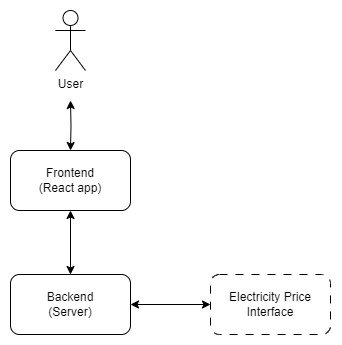

# Program structure

The program consists of a frontend and a backend. Backend uses api calls to fetch electricity prices from outside interface.

## Backend

The backend of the program is located in 'backend'-folder.

### index.js

The simple server running backend

### fetchElectricityPrice.js

Fetches the prices from api and saves them to a json-file. If price is not available, forecasts or gives fixed price.

### convertToFinnishTime.js

Converts fetched prices from UTC-time to Finnish time.

## Frontend

The frontend of the program consists of components located in 'frontend/src/components'.

### Demo.jsx

The main view of the demo. Includes visual components, their borders and component menu.

### DemoClock.jsx

Demo time and the options related to that (speed, range and buttons).

### ElectricityPrice.jsx

Electricity price and consumption information in right bottom corner of the main page. Responsible for fetching the electricity prices from backend.

### EnergyComponent.jsx

Energy component info box shown on main view when mouse is over an energy component.

### EnergyComponentPage.jsx

Own pages of energy components. Can be accessed by clicking an energy component on main page.

### InformationPage.jsx

Information-page. Can be opened from the right top corner of the main page.

### NotFoundPage.jsx

Not found -page. User gets directed here if the page they are trying to access does not exist or can not be opened.

### RealtimeClock.jsx

Responsible for creating the real time for main page.

### WelcomePage.jsx

Welcome-page, starting page of the demo with description.
